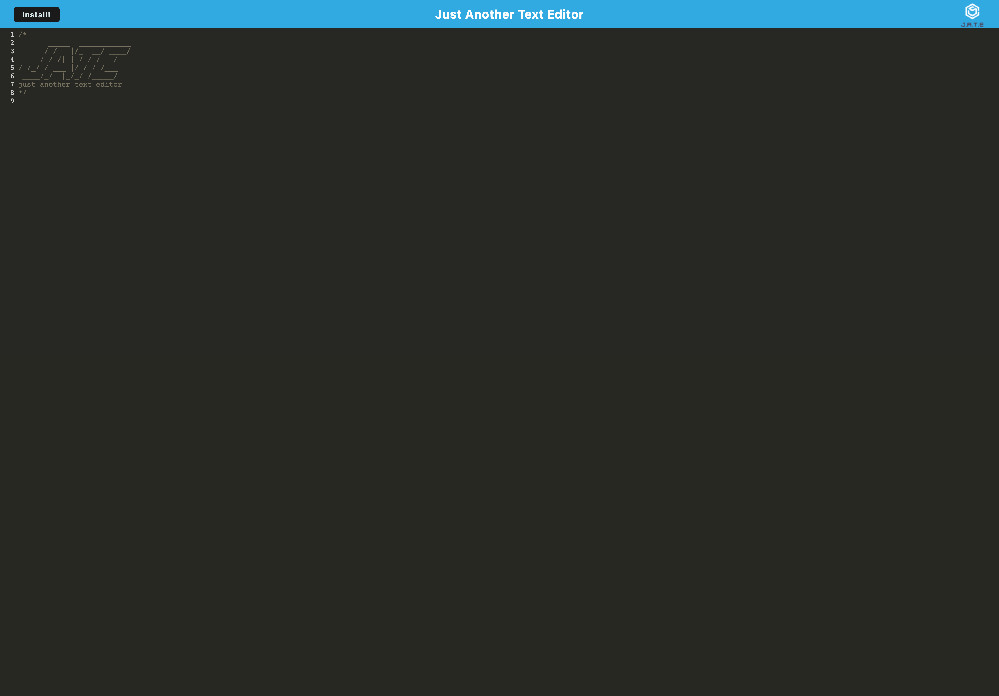

# Progressive Web App

### Description
This is a progressive web app that stores data in indexDB and can be installed to your device.

[Live Site](https://aqueous-depths-78486.herokuapp.com/)

### Installation
install dependancies

    npm install

start server

    npm start

### Contributions
[Issues and Pull requests can be made to this repo](https://github.com/SuedePritch/ubiquitous-carnival)

### Technology
* NodeJS
* Babel
* Webpack
* Express
* idb
* codemirror

